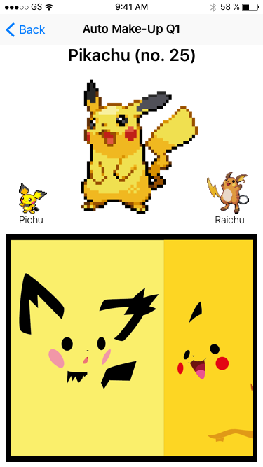

# AC3.2-Unit5Mid-Retake
---
### Part 1: Programmatic Autolayout

#### Design 1: Pokédex(-ish)

** Instructions **

Your goal is to reproduce the image below, with the following guidelines:

1. You can use any form of programmatic autolayout to do so (`NSLayoutConstraint`, Visual Format Language or `NSLayoutAnchor`)
2. Look over the provided `let`s in order to guide your spacing/margin/pt/colors. **YOU MUST USE THEM**
3. It should be obvious where each `let` is used in the image
4. The bottom image is intended to be scrollable horizontally. I have provided an image of what it looks like in its entirety




---
#### Design 2: Pokéball!

** Instructions **

Your goal is to reproduce the image below, with the following guidelines:

1. You will not have to use the helper function I showed you in class/that I used for the sample solution from the original Unit 5 assesment. This is to ensure you understand the theory behind what that function does instead of just copy/pasting code. 
2. Don't forget to add in the `pikachuImageView`'s constraints
3. You must be able to transition back from landscape to portrait. This is a *real* app, and rotations should work both ways. 


---
### Part 2: Core Data and Nib-backed Table View Cells

**Instructions:**

Populate a Table View with a list of books, storing to Core Data. The table's cell must be defined
in a nib file displaying title, ingredients and URL. Two entry fields, one a ```UITextField``` in the
Navigation Bar, the other a ```UISearchBar``` in the table's header must perform the following operations.
The Text Field in the Navigation Bar must initiate queries on the API to bring in new books, using 
the text as a query parameter. The Search Bar in the Table View must filter the existing data 
in Core Data without making an API call.

Much of the code is already in place so that you can work on the key elements of the assignment: Core Data 
data modeling and display, and nib-backed Table View Cells.

What's there:

* A Table View Controller class named BooksTableViewController. It's created programmatically (no nib, no storyboard). 
* The Text Field and Search Bar have been added to the table view and  delegate methods set up to
handle basic interactions with them.
* APIRequestManager 
* Core Data support
* The NSAppTransportSecurity key to allow requests to our http endpoint

What's not there at all:

* The Table View Cell swift and xib files

What's partially there and needs fleshing out:

* The Table View Data Source Delegate methods are in their XCode-generated, basically empty, state. These 
need to be fully defined to display data from Core Data using ```NSFetchedResultsController```.
* A ```NSFetchedResultsController``` property has been partially defined but needs to be fully defined
	in terms of your Core Data model. See comment #1.
* Data captured by the API needs to be populated into your Core Data object. See comment #2.
* The ```initializeFetchedResultsController()``` method has been declared but needs to be completed
and customized to this application. See comment #3.
* The same ```initializeFetchedResultsController()``` method will need to be changed to support 
	filtering from the search bar using an ```NSPredicate```. I recommend getting it working without the filtering first.
	See comments #3 and #4.


For this portion of the assessment, you only need to work inside BooksTableViewController.swift, the 
Table View Cell nib and swift files you define, the Core Data datamodel file and the extension on the Entity 
object it generates. That's five files total.

#### API

The API is very simple and I've included the endpoint, the data call and the code that seeks to the start of the data array.
You only need to create and populate your Core Data object from the dictionaries that follow this format:

```javascript
{
  "title": "1Q84",
  "description": "In 1980s Tokyo, a woman who punishes perpetrators of domestic violence has ties to an aspiring novelist with an unusual project.",
  "contributor": "by Haruki Murakami",
  "author": "Haruki Murakami",
  "contributor_note": "",
  "price": 0,
  "age_group": "",
  "publisher": "Vintage",
  .
  .
  .
````

Include title, description and author in your model and be sure to handle empty fields, notably the description.

#### Core Data

Configure your Entity object to be unique on the title field.

#### Table View Cell

Create the ```UITableViewCell``` subclass and its associated XIB. Configure your table to use
it and use automatic table cell heights by configuring the row height on the table appropriately
and by defining the constraints in the Table View Cell correctly.

```
+--------------------------------------+
| 1Q84                                 | <- Bold
| Haruki Murakami                      |
|                                      |
| In 1980s Tokyo, a woman who punishes | <- Variable height UILabel which will
| perpetrators of domestic violence has|    ultimately define the height of the cell.
| ties to an aspiring novelist with an |
| unusual project.                     |
+--------------------------------------+
```
